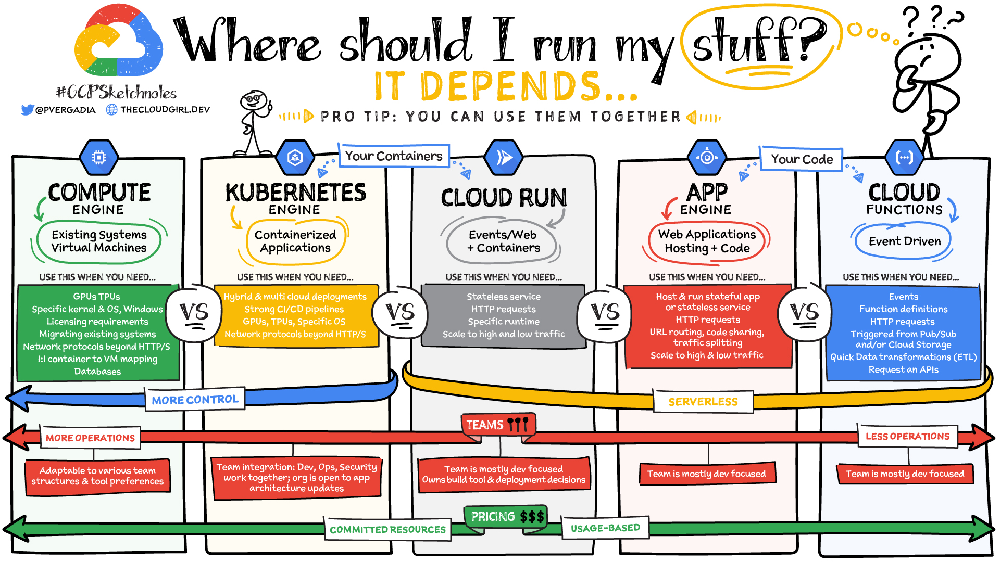
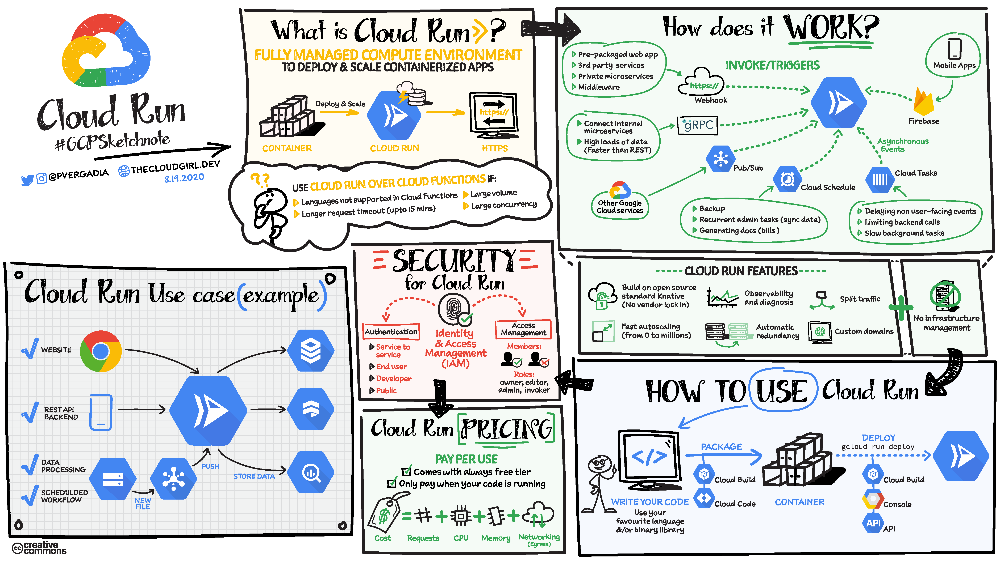

# GCPSketchnote

## The Google Cloud Developer's Visual Notes
Every product in the Google Cloud family described in the visual sketchnote format to grasp the capability of the tools quickly and easily.
by the Google Developer Relations Team

Pull requests are welcome on README.md (this file).

Feedback and suggestions? [@pvergadia](https://twitter.com/pvergadia). You can also check my blog - [https://thecloudgirl.dev](https://thecloudgirl.dev)

**Note:** This project is a work in progress and this list only includes products that are publicly available. There are several products in pre-release/private-alpha that will not be included until they go public beta or GA.

Many of these products have a [free tier](https://cloud.google.com/free/). There is also a [free trial](https://console.cloud.google.com/freetrial) that will enable you try almost everything.

----------------------------
# All GCP Sketchnotes
:link:-Youtube Video
:page_facing_up:-Image
:page_facing_down:-Blog

| Topic  | Description | GCPSketchnote Video | GCPSketchnote Image | Docs | Product |
| ------------- | ------------- |---|---|---|---|
| **Compute Options**  | Where should I run my stuff?  | |  |  |   |
| **Cloud Run**  | Serverless for containerized applications  |  |  | [:link:](https://cloud.google.com/run/) | [:page_facing_up:](https://cloud.google.com/run/docs/)

### Compute

* **Compute Options**: Where should I run my stuff? [:link:](https://www.youtube.com/watch?v=hEK5SMzI_n4&list=PLTWE_lmu2InBzuPmOcgAYP7U80a87cpJd) [:page_facing_up:](https://thecloudgirl.dev/gcpsketchnote1.html)
* **Cloud Run**: Serverless for containerized applications [:link:](https://www.youtube.com/watch?v=oR4btKLRdn4&list=PLTWE_lmu2InBzuPmOcgAYP7U80a87cpJd) [:page_facing_up:](https://thecloudgirl.dev/CloudRun.html)
* **Cloud Functions**: Event-driven serverless functions [:link:](https://www.youtube.com/watch?v=LTMChfWBHb0&list=PLTWE_lmu2InBzuPmOcgAYP7U80a87cpJd&index=17) [:page_facing_up:](https://thecloudgirl.dev/CloudFunctions.html)
* **Compute Engine**: VMs, GPUs, TPUs, Disks [:link:](https://www.youtube.com/watch?v=s1LxRhjPJ7E&list=PLTWE_lmu2InBzuPmOcgAYP7U80a87cpJd) [:page_facing_up:](https://thecloudgirl.dev/gcpsketchnote2.html)
* **Kubernetes Engine (GKE)**: Managed Kubernetes/containers [:link:](https://www.youtube.com/watch?v=F8s-DAfMtRM&list=PLTWE_lmu2InBzuPmOcgAYP7U80a87cpJd) [:page_facing_up:](https://thecloudgirl.dev/GKE.html)

https://j.gifs.com/6X3N7l.gif
https://j.gifs.com/mODjVr.gif

### Migration to GCP  
  
* **Migration Journey**: [:link:](https://www.youtube.com/watch?v=ZDn6zIaBfas&list=PLTWE_lmu2InBzuPmOcgAYP7U80a87cpJd) [:page_facing_up:](https://thecloudgirl.dev/MigrationJourney.html)[:page_facing_down:](https://cloud.google.com/blog/topics/developers-practitioners/google-cloud-migration-made-easy)
* **Migration Use cases**: Bulk import analytics data [:link:](https://www.youtube.com/watch?v=eWlQ-8AfDz4&list=PLTWE_lmu2InBzuPmOcgAYP7U80a87cpJd) [:page_facing_up:](https://thecloudgirl.dev/MigrationCheatsheet.html)[:page_facing_down:](https://cloud.google.com/blog/topics/developers-practitioners/google-cloud-migration-made-easy)
* **Redshift to BigQuery**: Bulk import analytics data[:page_facing_up:](https://thecloudgirl.dev/redshifttobq.html)

### Storage
  
* **Cloud Storage**: Multi-class multi-region object storage[:link:](https://www.youtube.com/watch?v=BeYr34swAVE&list=PLTWE_lmu2InBzuPmOcgAYP7U80a87cpJd) [:page_facing_up:](https://thecloudgirl.dev/CloudStorage.html)
  
### Database 
  
* **Cloud SQL**: Managed MySQL, PostgreSQL, SQL Server [:link:](https://www.youtube.com/watch?v=nGwOPAqgX7U&list=PLTWE_lmu2InBzuPmOcgAYP7U80a87cpJd) [:page_facing_up:](https://thecloudgirl.dev/gcpsketchnote3.html)
  
### Data and Analytics 
  
* **How to build a scalable data anytics pipeline?**: 5 steps to build a data analytics pipeline in GCP [:link:](https://www.youtube.com/watch?v=iIxq9x8jBa8&list=PLTWE_lmu2InBzuPmOcgAYP7U80a87cpJd) [:page_facing_up:](https://thecloudgirl.dev/analytics.html) [:page_facing_down:](https://www.freecodecamp.org/news/scalable-data-analytics-pipeline/)
* **BigQuery**: Data warehouse/analytics [:link:](https://www.youtube.com/watch?v=So-tVyBQt8E&list=PLTWE_lmu2InBzuPmOcgAYP7U80a87cpJd) [:page_facing_up:](https://thecloudgirl.dev/bigquery.html)
* **Cloud Composer**: Managed workflow orchestration service [:link:](https://www.youtube.com/watch?v=BRQw064uaMg&list=PLTWE_lmu2InBzuPmOcgAYP7U80a87cpJd) [:page_facing_up:](https://thecloudgirl.dev/Composer.html)
* **Cloud Dataflow**: Stream/batch data processing [:link:](https://www.youtube.com/watch?v=WRspZRG9e90&list=PLTWE_lmu2InBzuPmOcgAYP7U80a87cpJd) [:page_facing_up:](https://thecloudgirl.dev/dataflow.html)
* **Cloud Dataproc**: Managed Spark and Hadoop [:link:](https://www.youtube.com/watch?v=32oJE-fSzm0&list=PLTWE_lmu2InBzuPmOcgAYP7U80a87cpJd) [:page_facing_up:](https://thecloudgirl.dev/Dataproc.html/)
* **Cloud Pub/Sub**: Global real-time messaging [:link:](https://www.youtube.com/watch?v=JrKEErlWvzA&list=PLTWE_lmu2InBzuPmOcgAYP7U80a87cpJd) [:page_facing_up:](https://thecloudgirl.dev/pubsub.html)
* **Pub/Sub Lite vs Pub/Sub**: Difference between Pub/Sub and Pub/Sub Lite [:page_facing_up:](https://thecloudgirl.dev/gcpsketchnote4.html)

### AI/ML 

* **Contact Center AI**: AI in your contact center[:link:](https://www.youtube.com/watch?v=oGHa3hyMMsc&list=PLTWE_lmu2InBzuPmOcgAYP7U80a87cpJd) [:page_facing_up:](https://thecloudgirl.dev/CCAI.html)

### Networking 

* **Cloud Armor**: DDoS protection and WAF [:link:](hhttps://www.youtube.com/watch?v=w6Z5Ps0rXvk&list=PLTWE_lmu2InBzuPmOcgAYP7U80a87cpJd) [:page_facing_up:](https://thecloudgirl.dev/CloudArmor.html)
* **Cloud CDN**: Content delivery network [:link:](https://www.youtube.com/watch?v=EumuFAfTWJY&list=PLTWE_lmu2InBzuPmOcgAYP7U80a87cpJd) [:page_facing_up:](https://thecloudgirl.dev/CDN.html)
* **Cloud Load Balancing**: Multi-region load distribution/balancing [:link:](https://www.youtube.com/watch?v=0fQr7TRhnnU&list=PLTWE_lmu2InBzuPmOcgAYP7U80a87cpJd) [:page_facing_up:](https://thecloudgirl.dev/CLB.html)

### Identity and Security

* **Cloud Data Loss Prevention API**: Classify and redact sensitive data [:link:](https://www.youtube.com/watch?v=ab_Dctdu2G8&list=PLTWE_lmu2InBzuPmOcgAYP7U80a87cpJd) [:page_facing_up:](https://thecloudgirl.dev/dlp.html)

### Developer Tools  
  
* **Cloud Build**: Continuous integration/delivery platform [:link:](https://www.youtube.com/watch?v=Bvo6jzC3J_A&list=PLTWE_lmu2InBzuPmOcgAYP7U80a87cpJd) [:page_facing_up:](https://thecloudgirl.dev/CloudBuild.html)
* **Operations**: Monitoring, logging, troubleshooting [:link:](https://www.youtube.com/watch?v=Y7L2y6NVa9Y&list=PLTWE_lmu2InBzuPmOcgAYP7U80a87cpJd) [:page_facing_up:](https://thecloudgirl.dev/ops.html)

  
### Miscellenious  
  
* **Next 2020 Summary Announcements**: Summary NEXT2020 [:link:](https://www.youtube.com/watch?v=7OBTwoBZ404&list=PLTWE_lmu2InBzuPmOcgAYP7U80a87cpJd) [:page_facing_up:](https://thecloudgirl.dev/NEXT2020.html)

